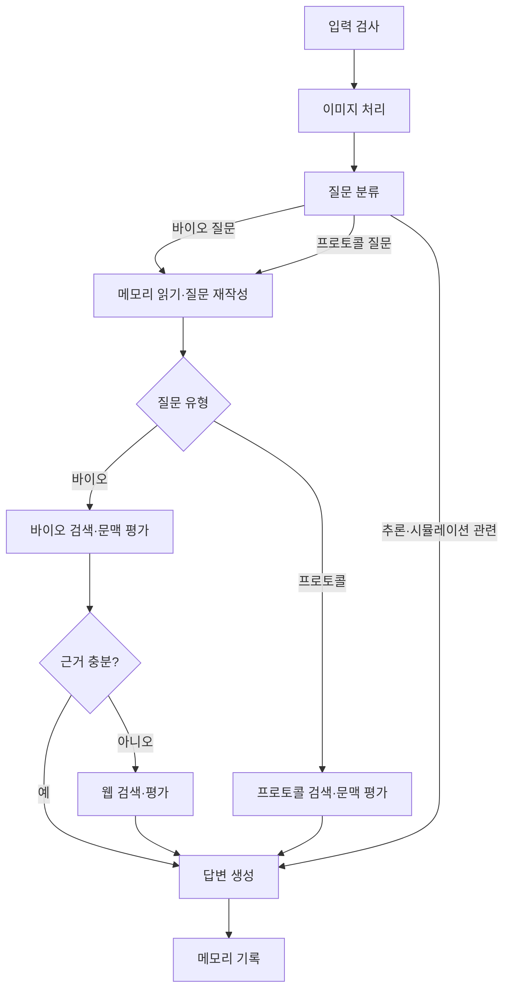

# 18기 2팀 HelixOps 우선 분석

확인일: 2026-09-26  
대상: [SKN18-FINAL-2TEAM](https://github.com/SKNETWORKS-FAMILY-AICAMP/SKN18-FINAL-2TEAM)

**가장 참고할 점은 연구자의 업무 흐름과 데이터 품질 관리다.** “잘했다”는 평판을 공식 순위나 수상 사실로 확인한 것은 아니다. 아래 평가는 공개 README와 관련 파일을 읽은 결과이며 실행 검증은 포함하지 않는다.

## 1. 어떤 문제를 풀었나

연구자의 문헌 탐색, 가설·실험 준비, 결과 해석, 연구 기록을 연결하는 바이오 연구 지원 플랫폼이다. 질문에 답하는 기능 외에 연구 과정의 자료와 결과물을 이어 붙이려는 설계가 드러난다.

README는 PMC, Protocols.io, ClinicalTrials, PrimeKG 등의 자료와 바이오 지식 검색, 프로토콜 검색, 실험 관련 기능, 연구 노트를 설명한다. 자료별 수집 가능 범위와 이용 조건은 별도로 확인해야 한다. 공개 사이트에 있다는 사실만으로 모든 내용을 자유롭게 학습에 사용할 수 있는 것은 아니다. [프로젝트 README](https://github.com/SKNETWORKS-FAMILY-AICAMP/SKN18-FINAL-2TEAM/blob/main/README.md)

공개 팀 소개는 6인 구성이고 회고에는 약 두 달의 개발 맥락이 나온다. 우리 팀은 5명·약 6주이므로 기능 수와 인프라 구성을 그대로 복제하기보다 핵심 업무 흐름 하나를 추려야 한다.

## 2. 실제 그래프에서 확인한 흐름

이 그림은 주요 경로를 단순화한 것이다. 실제 그래프에는 무관한 질문 종료, 사용자 정보 처리 등도 있다. 그래프에 등록된 노드는 13개이며 **13개의 독립 에이전트라는 뜻은 아니다.** SIMULATION 분기가 있다는 사실만으로 이 그래프가 실제 실험 시뮬레이터를 실행한다고 해석해서도 안 된다. 해당 분기는 답변 생성으로 연결된다. [그래프 구성 코드](https://github.com/SKNETWORKS-FAMILY-AICAMP/SKN18-FINAL-2TEAM/blob/main/graph/compile.py#L75)

확인한 모델 배치는 다음과 같다.

| 처리 | 코드상 배치 | 해석 |
| --- | --- | --- |
| 입력 안전 검사·질문 분류 | sLLM | 자체 모델을 입력 단계에 배치 |
| 메모리 요약·질문 재작성·검색 전략 | GPT-4.1 nano | 외부 모델을 이용하는 공통 처리 |
| 바이오·프로토콜 검색 문맥 평가 | GPT-4o mini | 프로토콜도 외부 평가 모델 호출 경로가 있음 |
| 바이오·시뮬레이션·정보 답변 | GPT-4.1 nano | 모든 응답을 자체 모델이 만드는 구조는 아님 |
| 프로토콜·추론 답변 | sLLM | 도메인 답변 생성에 자체 모델을 배치 |

출처: [모델 설정](https://github.com/SKNETWORKS-FAMILY-AICAMP/SKN18-FINAL-2TEAM/blob/main/graph/llm_config.py#L23). 설정과 코드 경로를 확인한 것이며 실서비스의 현재 환경변수·배포 상태까지 확인한 것은 아니다.

## 3. 잘 가져올 만한 설계

### 업무 결과물이 분명하다

논문을 찾는 단일 챗봇에서 끝나지 않고 연구자가 다음 단계에서 사용할 자료, 해석, 기록을 연결한다. 우리 팀도 “사용자가 무엇을 입력하면 어떤 검토 문서가 남는가”를 먼저 정하면 에이전트 역할과 화면 구성이 쉬워진다.

### 모델을 업무 단계에 맞춰 나눈다

분류, 재작성, 문맥 평가, 최종 생성에 다른 모델을 배치한다. 이 접근을 참고하되 모델 수 자체를 늘릴 필요는 없다. 우리 팀은 우선 외부 범용 모델 1종과 파인튜닝 sLLM 1종으로 품질·비용을 비교하는 편이 관리하기 쉽다.

### 학습 데이터 생성 뒤 품질 검사가 있다

SFT 자료 제작 문서는 논문의 관찰·질문·해석 경계를 구조화하는 흐름을 설명한다. 감사 코드는 규칙 검사와 선택적인 LLM 평가를 결합하고, 관찰 누락이나 과도한 인과 해석 등을 점검한다. 하드 실패는 FAIL로 처리하며 LLM 평가 경로에서는 점수를 최대 49로 제한한다. PASS 판정도 70점 미만이면 통과하지 못하게 하고, 통과 샘플만 별도 파일로 저장한다. 점수와 임계치는 이 프로젝트의 설계 값이다. [데이터 제작 문서](https://github.com/SKNETWORKS-FAMILY-AICAMP/SKN18-FINAL-2TEAM/blob/main/sllm/training/FINAL_SFT_DATASET_CREATION_REPORT.md), [감사 코드](https://github.com/SKNETWORKS-FAMILY-AICAMP/SKN18-FINAL-2TEAM/blob/main/sllm/training/dataset_auditor.py#L221)

우리 팀에 적용할 형태는 다음 정도면 충분하다.

1. 실제 업무 자료와 출력 규격을 정한다.
2. 사람이 검토한 소량 예시를 먼저 만든다.
3. 합성 예시를 확장하고 중복·누락·근거 불일치를 검사한다.
4. 통과·탈락 이유를 저장하고 사람이 일부를 다시 확인한다.
5. 학습에 사용하지 않은 평가셋으로 학습 전후를 비교한다.

LLM이 만들고 LLM이 평가했다고 해서 편향이나 오류가 사라지는 것은 아니다. 규칙 검사, 사람 검토, 독립 평가셋이 함께 필요하다.

### 검색 구조를 비교하려는 코드가 있다

A/B 평가 코드는 Neo4j 중심 검색과 PGVector·Neo4j 조합을 비교하며 검색 결과 ID, 지연 시간, 문맥, 선택적 응답·토큰 등을 기록한다. 구성요소를 바꿀 때 비교 기록을 남기는 습관을 참고할 수 있다. [A/B 평가 코드](https://github.com/SKNETWORKS-FAMILY-AICAMP/SKN18-FINAL-2TEAM/blob/main/kg/vector_search/eval_ab_v5.py)

## 4. 문서·코드 차이와 재현 한계

| 항목 | 공개 자료에서 확인한 사실 | 우리 팀이 남겨야 할 증거 |
| --- | --- | --- |
| 최종 모델 | README는 Gemma 3 12B QLoRA를 설명하지만 공개 서빙 문서에는 4B 어댑터 실행 예시와 12B 양자화 실패 메모가 함께 있다 | 실제 사용 모델 ID·revision·어댑터·배포 이미지·작동 로그를 한 곳에 기록 |
| 학습 재현 | run_finetune.py에는 라마팩토리를 사용했다는 주석만 있다. 해당 파일만으로 학습을 재현할 수 없다 | 학습 설정, 데이터 버전, 실행 명령, 라이브러리 버전, 결과 파일 |
| 프로토콜 외부 전송 | 프로토콜 분기에 웹 검색 fallback은 없지만 공통 재작성·문맥 평가는 외부 모델을 사용하고 임베딩도 HF Endpoint 경로다 | 원문·질문·검색 문맥별 외부 전송 경로를 표로 작성 |
| 자동 테스트 | test.yml은 수동 실행되는 placeholder이며 실제 pytest 단계가 준비되지 않았다고 출력한다 | 실제 통과한 검사와 미구현 검사를 구분 |
| 성능 수치 | README에 개선 수치가 있으나 읽은 A/B 스크립트 하나가 모든 지표를 계산하는 것은 아니다 | 지표 정의, 정답셋, 평가 코드, 원시 결과, 실행 조건 연결 |

모델·서빙 근거: [학습 파일](https://github.com/SKNETWORKS-FAMILY-AICAMP/SKN18-FINAL-2TEAM/blob/main/sllm/training/run_finetune.py), [4B 및 12B 서빙 메모](https://github.com/SKNETWORKS-FAMILY-AICAMP/SKN18-FINAL-2TEAM/blob/main/sllm/tests/serving_llm_by_runpod.md#L61).  
전송 경로 근거: [모델 설정](https://github.com/SKNETWORKS-FAMILY-AICAMP/SKN18-FINAL-2TEAM/blob/main/graph/llm_config.py#L40), [임베딩 라우터](https://github.com/SKNETWORKS-FAMILY-AICAMP/SKN18-FINAL-2TEAM/blob/main/rag/retriver/embedding_router.py#L84).  
테스트 근거: [test.yml](https://github.com/SKNETWORKS-FAMILY-AICAMP/SKN18-FINAL-2TEAM/blob/main/.github/workflows/test.yml#L14).

위 차이들은 공개 저장소의 설명·버전 관리 문제를 보여준다. 비공개 환경이나 발표 당시 구현까지 없었다고 단정할 근거는 아니다.

### 성능 수치를 읽을 때 주의할 점

README는 환각 32%→8%, 문맥 누락 41%→5%, 응답 일관성 62%→91%, Top-3 검색 성능 40%→76% 등을 보고한다. **이번 조사에서 재현한 수치가 아니다.** 다른 팀과 데이터·평가 기준이 달라 직접적인 순위 비교에 쓰기 어렵다. [README 평가 부분](https://github.com/SKNETWORKS-FAMILY-AICAMP/SKN18-FINAL-2TEAM/blob/main/README.md)

“상위 3개 중 정답 문서가 하나라도 있는 비율”은 Hit@3이고, “상위 3개 중 관련 문서의 비율”인 Precision@3과 다르다. Ragas Context Precision은 검색 순서에 따른 정밀도를 반영하는 별도 정의다. 발표 자료에서도 지표 이름과 계산식을 일치시켜야 한다. [Ragas 공식 정의](https://docs.ragas.io/en/stable/concepts/metrics/available_metrics/context_precision/)

## 5. 우리 팀에 적용할 결정

| 바로 가져올 것 | 범위를 줄여 가져올 것 | 이번 MVP에서 보류할 것 |
| --- | --- | --- |
| 업무 단계와 결과물 중심 기획 | 에이전트 역할은 3~4개로 시작 | 바이오 연구 전체 과정 |
| 생성 데이터의 통과·탈락 기록 | sLLM 전문 태스크 1개부터 | 여러 모델 동시 파인튜닝 |
| 검색·생성 단계별 평가 | DB는 업무 DB+벡터 검색을 먼저 단순화 | GraphRAG와 복수 벡터 DB 동시 도입 |
| 문맥 부족 시 처리 분기 | 웹 검색은 꼭 필요한 업무만 | 실험 시뮬레이션·음성·이미지 동시 개발 |
| 실패 사례를 남기는 실험 | 사람 검토가 필요한 조건을 명시 | 검증되지 않은 성능 숫자 홍보 |

권장 참고 조합은 **HelixOps의 업무 흐름·데이터 감사 + HumouR의 좁은 파인튜닝 태스크 + GameOps의 단계별 평가 + Answervice의 재현 기록**이다. 자세한 연결은 [25개 비교표](./02-FINAL-25개-비교.md)와 [6주 준비안](./03-6주-프로젝트-준비안.md)에 정리했다.

