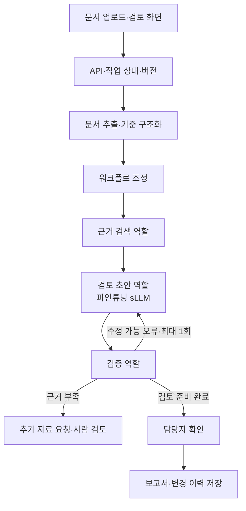

# 5명·약 6주 프로젝트 준비안

기준일: 2026-09-26. 약 1.5개월을 임시로 6주로 잡았다. 다음 주 시작을 9월 28일로 두면 11월 8일까지다. 정확한 제출일·평가표가 확인되면 역산해 조정한다. 아래 모델 크기, 샘플 수, 일정은 **제안값**이며 확정 조건이나 이미 달성한 결과가 아니다.

## 1. 과제 조건을 결과물로 바꾸기

| 과제 안내의 요구 | 제출물에서 보여줄 증거 |
| --- | --- |
| 특정 업무에서 실제 활용 | 사용자 1종, 업무 시작·종료, 전후 작업 예시, 저장되는 결과물 |
| 문서 작성·검색·검토의 에이전트 분담 | 역할별 입력·출력·사용 도구, 실행 흐름, 실패·재시도 기록 |
| 분야에 맞는 sLLM 개발·파인튜닝 | 데이터 출처·분할·정제, 학습 설정·체크포인트, 학습 전후 같은 평가 |
| 플랫폼으로 통합 | 화면→API→에이전트→sLLM→결과 저장까지 실제 연결한 시연 |
| 사용자 조건: 5명·약 6주 | 기능 제한, 담당자·검토자, 주간 통합 데모, GPU 비용 기록 |

RAG 구축, 외부 API 프롬프트 조정, 임베딩 모델만의 학습, 전통적 분류 모델 학습만으로 생성형 sLLM 파인튜닝 요구를 충족한다고 가정하지 않는다. 교수자에게 정확한 인정 범위를 첫 주에 확인하되, 준비안은 생성형 sLLM 어댑터 학습과 서비스 연결을 포함한다.

## 2. 우선 검토할 주제

| 후보 | 사용자·문제 | MVP 결과물 | sLLM 태스크 | 선행 조건 |
| --- | --- | --- | --- | --- |
| **1순위 검토: 업무 문서 검토 보조** | 산출물을 요구사항·체크리스트와 대조하는 실무자 | 항목별 충족·누락·불확실 판정, 근거 위치, 수정 제안 | 근거와 기준을 입력받아 구조화된 검토 의견 생성 | 검토할 문서와 정답 기준 확보 |
| CS 답변 초안 보조 | 반복 문의를 정책과 고객 상태에 맞춰 답하는 상담원 | 근거가 있는 초안, 추가 질문, 사람에게 넘길 사유 | 문의 유형·필요 정보 추출 또는 제한된 응답 형식 생성 | 공개 정책·FAQ와 합성 업무 데이터 |
| HR 서류 정리·면접 준비 보조 | 채용 자료를 읽고 면접을 준비하는 담당자 | 경력 사실 정리, 출처 문장, 확인 질문 | 이력의 구조화 또는 STAR 변환 | 이용 가능한 비식별·합성 자료와 검토자 |

문서 검토를 우선 제안하는 이유는 입력·기준·수정 결과를 비교하기 쉽고, 다중 에이전트와 sLLM 역할을 명확히 나눌 수 있기 때문이다. 실제 계약의 법적 판단이나 채용 최종 결정을 자동화하는 범위까지 넓히지 않는다.

자료 확보가 어려우면 CS처럼 정답을 직접 검토할 수 있는 분야로 이동한다. 기술보다 **자료·업무 지식·평가 가능성**을 먼저 통과시킨다. 참고 사례: [Workit](https://github.com/SKNETWORKS-FAMILY-AICAMP/SKN26-FINAL-4TEAM), [ALPLED](https://github.com/SKNETWORKS-FAMILY-AICAMP/SKN24-FINAL-3Team), [GameOps](https://github.com/SKNETWORKS-FAMILY-AICAMP/SKN25-FINAL-6Team), [HumouR](https://github.com/SKNETWORKS-FAMILY-AICAMP/SKN26-FINAL-1Team).

### 첫 2일의 주제 결정 기준

1. 팀원이 설명할 수 있는 사용자와 반복 업무가 있는가.
2. 합법적으로 이용할 원문·규정·예시를 확보할 수 있는가.
3. 사람이 “이 결과는 맞다/틀리다”를 판단할 기준을 만들 수 있는가.
4. sLLM을 학습시킬 구체적인 입출력 쌍이 있는가.
5. 2주차에 화면부터 결과물까지 연결할 수 있는가.

후보별 대표 입력 3개와 기대 출력 3개를 직접 만들어 본 뒤 하나를 고른다. 점수표를 채우는 데 시간을 쓰기보다 이 샘플을 실제로 완성하는 것이 결정에 도움이 된다.

## 3. 문서 검토 MVP 예시

가정: 한 종류의 업무 산출물을 하나의 기준 문서와 비교한다. 예를 들면 요구사항 목록과 개발 산출물 간 누락 점검이다.

사용자 흐름:

1. 기준 문서와 검토할 문서를 올린다.
2. 추출된 텍스트·문서 버전을 확인한다.
3. 기준별 근거, 누락 가능 항목, 수정 제안을 받는다.
4. 원문 위치를 보며 제안을 수정·채택·반려한다.
5. 검토 보고서와 처리 이력을 저장한다.

**완료 기준:** 질문에 답하는 데 그치지 않고 검토 항목별 근거와 담당자의 판단이 남아야 한다.

MVP에 넣을 기능은 문서 업로드, 텍스트 추출, 기준별 검색, 검토 초안, 근거 표시, 사람 확인, 결과 저장이다. 스캔 PDF OCR, 음성, 웹 검색, 다양한 문서 형식, 외부 협업 도구 쓰기, 에이전트 생성 플랫폼은 후순위로 둔다. 첫 문서 형식은 실제 확보 자료를 보고 결정한다.

## 4. 제안 구성



검색, 초안, 검증의 3개 역할로 시작한다. 조정기는 상태와 분기를 관리하며 처음부터 자유로운 계획 수립 모델일 필요는 없다. 파일 파싱·금액 계산·스키마 검사처럼 규칙이 분명한 처리는 코드로 구현한다.

| 구성 | 초기 제안 | 늘리는 조건 |
| --- | --- | --- |
| 화면 | 팀이 익숙한 프런트엔드 하나 | 복잡한 프레임워크 교체 없이 근거 표시·진행 상태부터 |
| API | FastAPI 등 팀 주력 백엔드 하나 | Django가 꼭 필요한 기존 역량·기능이 있을 때 별도 검토 |
| 워크플로 | LangGraph 또는 명시적인 상태 머신 | 관측 가능한 분기·실패 처리를 먼저 완성 |
| 데이터 | PostgreSQL + pgvector를 우선 검토 | 검색 품질·필터·운영 요구가 부족하다는 측정 근거가 있을 때 분리 |
| 모델 | 비교용 범용 모델 1종 + 학습 sLLM 1종 | 실패 분석에서 이유가 확인될 때 추가 |
| 학습·서빙 | RunPod 학습 환경과 데모 서빙 환경의 설정을 분리 | 실제 부하·비용을 보고 상시/탄력 운영 선택 |

이 표는 스택 확정안이 아니다. 팀원 역량과 첫 주 실행 결과로 고른다. 선행 팀들이 사용했다는 이유만으로 Django·FastAPI·Neo4j·벡터 DB·Redis를 전부 도입하지 않는다.

### 에이전트 사이에 넘길 최소 정보

공통으로 작업 ID, 문서 ID·버전, 기준 ID, 근거 위치, 결과 상태, 오류 코드, 모델·프롬프트 버전을 전달한다.

검토 결과의 예:

```json
{
  "criterion_id": "REQ-017",
  "status": "needs_review",
  "evidence": [{"document_id": "DOC-02", "page": 3, "span_id": "S-42"}],
  "reason": "응답 시간 목표는 있으나 측정 조건이 명시되지 않음",
  "suggestion": "동시 사용자 수와 측정 환경을 추가해 주세요.",
  "requires_human_review": true
}
```

검색 결과에서 못 찾았다는 사실과 문서 전체에 없다는 판단을 구분한다. 근거가 부족하면 추가 검색이나 확인 필요 상태를 반환한다. 모델이 만든 근거 ID·페이지가 실제 문서에 존재하는지도 서버에서 검사한다.

## 5. 데이터와 파인튜닝

### 태스크부터 고정한다

초기 태스크는 “기준 + 관련 문맥 → 구조화된 검토 의견”처럼 하나로 잡는다. 지식 전체를 외우게 하기보다 업무에 맞는 출력과 판단 경계를 학습하고, 최신 기준은 검색으로 제공한다.

베이스 모델은 라이선스·한국어·정해진 출력·서빙 호환성을 확인한 후 고른다. 첫 실험은 2~4B급도 후보로 두고, 충분하지 않다는 검증 결과가 나오면 7~8B급을 비교한다. 특정 모델이나 GPU의 적합성을 아직 확정하지 않았다.

### 데이터 제작 순서

1. 업무 담당자 관점에서 개발용 사례 약 30개와 검토 기준을 만든다.
2. 학습·검증·최종 평가를 원문 또는 문서 계열 단위로 나눈다. 같은 문서를 조금 바꾼 사례가 여러 집합에 섞이지 않게 한다.
3. 소량 학습으로 데이터 로딩·토크나이징·저장·어댑터 서빙을 먼저 확인한다.
4. 검토된 학습 사례 수백 건부터 시작해 오류 유형을 보며 확장한다. 초기 300~1,000건은 작업량 추정용 범위이며 품질 보장 기준이 아니다.
5. 누락·중복·출처 없는 주장·형식 오류·정답 불일치를 검사하고 통과/탈락 이유를 저장한다.
6. 사람이 일부를 재검토하고 중요 오류 유형은 더 많이 표본 추출한다.

RAG 평가에서 정답 근거 문서가 검색 코퍼스에 존재하는 것은 정상이다. 다만 평가용 정답 답변·판정 설명을 학습 자료나 검색 문서에 섞어 정답을 유출하면 안 된다. 새로운 문서로 일반화하는 평가와 기존 코퍼스에서 근거를 찾는 평가는 목적을 나누어 설계한다.

### 실험 기록

베이스 모델 revision, 어댑터, 데이터 hash·분할, 프롬프트, 코드 커밋, 패키지 버전, LoRA 설정, 최대 길이, GPU, 걸린 시간, 비용, 평가 ID를 한 기록에 묶는다. 모든 실험에 성공 결과가 있을 필요는 없지만 실행 여부와 실패 이유는 남긴다. [HumouR 학습·서빙](https://github.com/SKNETWORKS-FAMILY-AICAMP/SKN26-FINAL-1Team), [Answervice 학습 코드](https://github.com/SKNETWORKS-FAMILY-AICAMP/SKN29-FINAL-3TEAM/blob/main/src/ai/training/train_lora.py)를 참고했다.

## 6. 평가 설계

### 비교군

| 비교 | 목적 |
| --- | --- |
| 베이스 sLLM + 동일 프롬프트 | 학습 이전 기준 |
| 베이스 sLLM + RAG | 검색으로 얻는 개선 |
| 파인튜닝 sLLM + 동일 RAG | 동일한 근거 조건에서 파인튜닝 효과 |
| 필요 시 단일 생성 흐름 vs 역할 분담 흐름 | 에이전트 분업으로 얻는 품질·비용 변화 |

외부 대형 모델은 참고 상한선으로 비교할 수 있다. 그러나 모델 크기·검색 구성까지 바꾼 결과를 파인튜닝의 효과라고 부르면 안 된다. 비교 목적에 맞게 나머지 조건을 맞춘다.

### 지표

| 대상 | 지표·검사 | 주의점 |
| --- | --- | --- |
| 검색 | Recall@k, Hit@k 또는 MRR 중 목적에 맞게 선택 | 정답 문서·청크 기준과 k를 명시 |
| 구조화 태스크 | 필드별 Precision·Recall·F1, JSON 유효율 | 평균과 중요 클래스 누락을 함께 표시 |
| 검토 내용 | 근거 일치·기준 충족·과도한 판단·수정 가능성 | 사람 검토 일부와 LLM 평가를 대조 |
| 업무 전체 | 완료율, 사람 수정량, 동일 과업의 처리 시간 | 품질이 같거나 나아졌을 때 시간 절감 해석 |
| 운영 | p50·p95 지연, 실패율, 요청당 비용 | 입력 길이·동시성·cold/warm 구분 |

Ragas Context Precision을 사용할 경우 해당 도구의 정의를 그대로 기록한다. 단순 문서 적중률과 같은 이름으로 섞지 않는다. [공식 지표 설명](https://docs.ragas.io/en/stable/concepts/metrics/available_metrics/context_precision/)

2주차까지 검증용 사례와 분리된 최종 평가셋 약 80~120건을 고정하는 것을 제안한다. E2E 사람 확인용 대표 시나리오 약 20~30건을 별도로 둔다. 샘플 수는 데이터와 검토 시간에 맞춰 조정하고, 최종 평가셋을 반복해서 보고 튜닝하지 않는다.

초기 형식 유효율 목표는 95% 이상으로 제안하되, 업무 정확도 목표는 첫 주 베이스라인을 본 뒤 정한다. API 실패·문서 없음·근거 없음·중복 요청 등의 필수 예외 시나리오는 정해진 기대 동작을 모두 통과하도록 한다. 소수 사례에서 100% 통과해도 모든 상황의 안전성이나 정확도를 보장한다고 발표하지 않는다.

## 7. RunPod 운영 제안

- 첫날 모델 로딩·짧은 학습·어댑터 추론을 확인한 뒤 GPU 종류를 결정한다. 모델 크기만으로 필요한 VRAM을 단정하지 않는다.
- 학습 담당자와 대체 담당자 1명을 두고 GPU 사용 시간대를 공유한다.
- 시간당 단가, 사용 시간, 디스크, 외부 모델 API 비용을 합산한다. 예산 상한은 아직 미정이며 실제 생성 전 견적을 확정한다.
- 체크포인트·학습 설정·로그는 종료 전에 지속 저장소나 별도 저장소로 내보내고 복구를 확인한다.
- RunPod Pod의 컨테이너 디스크는 중지·재시작 과정에서 보존을 기대하면 안 된다. 볼륨 디스크는 중지 시 유지되지만 종료 시 삭제될 수 있고, 네트워크 볼륨은 Pod와 독립적으로 유지된다. 중지한 볼륨에도 비용이 들 수 있다. [RunPod Pod 관리 문서](https://docs.runpod.io/pods/manage-pods)
- Serverless의 flex worker는 0으로 줄여 비용을 낮출 수 있으나 cold start가 발생할 수 있다. active worker는 상시 준비 상태를 유지하는 대신 비용이 든다. 발표 전 실제 모델의 시작 시간을 측정해 선택한다. [RunPod worker 문서](https://docs.runpod.io/serverless/workers/overview)

예산 기록식: **GPU 시간 × 확인한 시간당 요금 + 저장 공간 요금 + API 사용료 + 해당되는 네트워크 비용**. 이 문서에는 확인하지 않은 현재 GPU 가격을 넣지 않았다.

## 8. 6주 일정

| 주차·임시 날짜 | 주간 목표 | 금요일에 보여줄 것 | 범위 통제 |
| --- | --- | --- | --- |
| 1주차 · 9/28~10/4 | 주제·데이터·역할 확정, 입출력 계약, 베이스라인, 소량 학습 연결 | 대표 문서 1건의 입력→결과, 학습·서빙 smoke 결과 | 자료 확보 실패 시 주제 전환 |
| 2주차 · 10/5~10/11 | 화면·API·에이전트·sLLM 첫 통합, 평가셋 고정 | 3개 역할이 실제로 이어지는 E2E, 첫 어댑터 결과 | 모의 출력과 실제 출력 구분 |
| 3주차 · 10/12~10/18 | 데이터 개선·학습 v1, 검색/학습 비교 | 같은 평가셋의 전후 결과와 주요 실패 유형 | 기능 추가보다 병목 개선 |
| 4주차 · 10/19~10/25 | 사람 확인, 예외 경로, 저장·배포 안정화 | 정상·근거 부족·모델 실패 시연 | 핵심 사용자 흐름 고정 |
| 5주차 · 10/26~11/1 | 성능·비용·지연 검증, 기능 동결 | 재현 가능한 평가, 제출 문서 초안 | 새로운 주요 기능 금지 |
| 6주차 · 11/2~11/8 | 최종 평가, 발표·데모·복구 연습 | 고정 버전 배포, 영상, 모델·데이터·실험 증거 | 버그 수정·발표 준비 중심 |

공휴일·교육 일정·팀원 참여 시간을 반영하기 전 계획이다. 6주는 30일의 실제 개발일을 보장하지 않으므로 첫 주에 가용 시간을 확인한다.

## 9. 착수 회의에서 결정할 것

1. 정확한 마감일, 채점표, 필수 제출물과 파인튜닝 인정 범위.
2. 후보 업무 중 자료 3건·기대 결과 3건을 만들 수 있는 하나.
3. 팀원별 주력 역량과 역할·대체 담당자.
4. GPU/API 총예산, 자원 생성·종료 담당자.
5. 평일 작업 시간, 리뷰 시간, 주간 데모 시간.

PM의 첫 업무는 큰 기능 목록을 만드는 것이 아니라 **“이 사례 하나를 제대로 처리하면 어떤 가치가 생기는가”를 팀이 같은 말로 설명하게 하는 것**이다.

