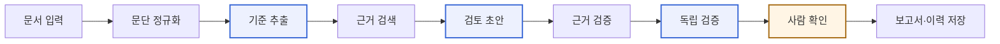

# 착수 회의 — 주제·구성·역할

기준일: 2026-09-27 · 회의일: 2026-09-28 · 5명, 약 6주.

추천 주제는 **업무 문서 검토 보조**입니다. 기준 문서와 검토 대상 문서를 비교해 항목별로 충족·누락을 판정하고, 근거 원문과 수정 제안을 함께 냅니다. 회의에서 아래 다섯 가지를 확정하면 1주차 금요일에 첫 통합 데모를 보여줄 수 있습니다.

이 문서는 회의용 요약입니다. 근거가 되는 조사와 상세 계획은 [6주 준비안](./03-6주-프로젝트-준비안.md), [협업 규칙](./04-5인팀-협업규칙.md), [착수 전 선작업](./06-착수전-선작업.md)에 있습니다.

## 추천 주제

1순위는 업무 문서 검토 보조입니다. 입력·기준·결과를 비교하기 쉽고, 에이전트 역할과 sLLM 태스크를 명확히 나눌 수 있기 때문입니다.

| 후보 | 사용자 | MVP 결과물 | sLLM 태스크 |
| --- | --- | --- | --- |
| 문서 검토 보조 (1순위) | 산출물을 요구사항·체크리스트와 대조하는 실무자 | 항목별 판정, 근거 위치, 수정 제안 | 근거와 기준을 받아 구조화된 검토 의견 생성 |
| CS 답변 검수 | 정책에 맞춰 반복 문의에 답하는 상담원 | 근거 있는 초안, 추가 질문, 이관 사유 | 문의 유형·필요 정보 추출 |
| HR 서류 정리 | 채용 자료로 면접을 준비하는 담당자 | 경력 사실 정리, 출처 문장, 확인 질문 | 이력의 구조화 또는 STAR 변환 |

### 주제를 고르는 기준은 기술이 아니라 자료입니다

아래 세 가지를 통과하지 못하면 다른 후보로 옮깁니다.

1. 팀원이 설명할 수 있는 사용자와 반복 업무가 있다.
2. 합법적으로 이용할 원문·규정·예시를 확보할 수 있다.
3. 사람이 결과의 맞고 틀림을 판단할 기준을 만들 수 있다.

후보별로 대표 입력 3건과 기대 출력 3건을 직접 만들어 본 뒤 고릅니다. 점수표를 채우는 것보다 이 샘플이 결정에 더 도움이 됩니다.

## 프로그램 구성

문서가 들어오면 아홉 단계를 거쳐 판정과 수정 제안이 나옵니다. 모델은 세 번만 부르고, 근거가 원문과 맞는지는 코드가 검사합니다.

파란 상자가 모델 호출이고 주황 상자가 사람 확인입니다. 나머지는 코드가 처리합니다. 검색과 근거 대조를 코드가 맡기 때문에, 모델이 없는 근거를 지어내도 자동으로 걸러집니다.

| 모델 역할 | 하는 일 | 출력 |
| --- | --- | --- |
| 기준 추출 | 기준 문서에서 검토 항목을 뽑는다 | 기준 ID, 제목, 원문 인용 |
| 검토 초안 | 기준별로 대상 문서를 판정하고 수정안을 쓴다 | 판정, 사유, 근거, 수정 제안 |
| 독립 검증 | 초안을 다시 보고 미심쩍은 항목을 표시한다 | 확인이 필요한 기준 목록 |

파인튜닝은 **검토 초안 역할 하나에만** 겁니다. 세 역할을 모두 학습시키려 하면 6주 안에 끝나지 않습니다.

### 판정은 다섯 가지

충족 · 부분 충족 · 미기재 · 불일치 · 확인 필요

평가 지표도, 학습 데이터 라벨도 여기서 나옵니다. 사람 5명이 같은 문서를 다르게 판정하면 모델은 맞추지 못합니다.

### 근거 규율 네 가지

이 네 줄이 제품의 차별점입니다. 설계 문서 첫 장에 그대로 박습니다.

1. 인용은 그 역할에 실제로 전달한 문단 안에 원문 그대로 있어야 한다.
2. 없으면 인용을 지우고 판정을 확인 필요로 내린다.
3. 미기재는 대상 문서 전체를 전달했을 때만 확정한다.
4. 독립 검증은 판정을 내릴 수만 있고 올릴 수는 없다.

## 역할 분담

다섯 명이 한 영역씩 맡고, 기능마다 개발 1명·검토 1명을 지정합니다.

| 역할 | 주 책임 | 1주차 첫 작업 |
| --- | --- | --- |
| PM | 범위·우선순위·완료 기준·통합 일정 | 교수자에게 채점표와 파인튜닝 인정 범위 확인 |
| 데이터·sLLM | 데이터 품질·분할·학습·모델 평가 | 원천 자료의 출처·이용 조건 조사 |
| 에이전트·RAG | 검색·워크플로·근거 연결 | 세 역할의 입출력 JSON 계약 고정 |
| 백엔드·기술 리드 | API·DB·작업 상태·배포·통합 | 새 저장소 생성, 브랜치 보호와 자동 검사 |
| 프런트·UX | 입력·근거 표시·승인·오류 화면 | 업로드에서 보고서까지 화면 흐름 시안 |

데이터·sLLM 담당은 첫날 RunPod에서 모델 로딩·짧은 학습·어댑터 추론까지만 확인합니다. 본학습은 주제와 자료가 정해진 뒤입니다.

역할은 독점 구역이 아닙니다. 한 사람의 주 작업은 하나로 제한하고, 작업 카드는 0.5일에서 2일 크기로 나눕니다. PM은 모든 PR의 승인자가 아니라 사용자 흐름과 범위가 바뀌는 변경만 확인합니다.

## 협업 규칙과 그라운드룰

규칙은 얇게 가져가되, 통합과 검증에 관한 것만 예외 없이 지킵니다.

### 매일·매주 리듬

- 매일 10분: 어제 끝낸 산출물, 오늘 합칠 변경, 막힌 점만 공유합니다.
- 30~60분 봐도 다음 시도가 안 보이면 재현 방법과 로그를 공유합니다. 하루 종일 혼자 붙들지 않습니다.
- 리뷰 시간은 하루 두 번 고정합니다. 예: 11:30, 16:30
- 한 사람의 주 작업은 1개입니다. 작업 카드는 0.5~2일 크기로, 3일을 넘으면 쪼갭니다.
- 금요일 데모 뒤 20분: 다음 주 범위와 가장 큰 위험 3개를 정합니다.

### Git과 PR

- main은 언제나 실행 가능한 상태를 유지합니다.
- 이슈 하나에 짧은 기능 브랜치. 개인 이름의 장기 브랜치는 쓰지 않습니다.
- 첫 동작이 나오면 Draft PR을 열어 인터페이스를 일찍 공유합니다.
- PR 하나에 목적 하나, 1~2일 안에 검토할 수 있는 크기로 만듭니다.
- 담당자 1명의 리뷰와 자동 검사를 통과하면 squash merge하고 브랜치를 정리합니다.
- API·공통 타입·DB를 바꾸면 그걸 쓰는 담당자를 리뷰에 넣습니다.
- main 직접 push 금지는 말로 정하지 않고 저장소 설정으로 겁니다. 첫날에 합니다.

PR에는 해결한 문제, 사용자에게 보이는 변화, 관련 이슈, 확인한 정상·실패 사례, 화면이면 캡처, 호환성 영향을 남깁니다. "AI가 작성함"과 "코드가 실행됨"은 검증 설명이 아닙니다.

### 통합 충돌 줄이기

- 2일차까지 문서 ID, 작업 ID, 결과 상태, 오류 형식, 에이전트 입출력 스키마를 정합니다.
- 모의 응답은 팀 공통 예시 파일 하나를 씁니다. 화면과 백엔드가 각자 다른 JSON을 만들지 않습니다.
- DB 변경은 마이그레이션 파일로 공유합니다. 개인 DB 수동 수정은 완료가 아닙니다.

### 완료의 정의

작업 카드는 아래를 모두 충족해야 끝난 것입니다.

- 요구한 입력과 기대 출력이 구현됨
- 실제 연결 또는 단계에 맞는 계약 검증을 통과함
- 대표 실패 사례가 처리됨
- 재현 방법과 결과를 PR에 남김
- 검토자가 확인하고 main에 병합함

모의 데이터만 연결된 기능은 "계약 구현 완료"이지 "실서비스 통합 완료"가 아닙니다. 수집한 테스트 수, 실행한 수, 통과한 수를 구분해서 말합니다.

### 그라운드룰 — 예외 없음

이 일곱은 바쁘다고 생략하지 않습니다. 어기면 발표 때 한 번에 터집니다.

1. 데모 출력을 모델 출력처럼 내놓지 않습니다.
2. 실행하지 않은 학습·배포·벤치마크는 미검증으로 적습니다.
3. 비밀키, 개인 문서, 모델 가중치, 런타임 DB는 Git에 넣지 않습니다.
4. 점수가 안 나온다고 정답을 바꾸지 않습니다. 오류 유형과 근거를 남깁니다.
5. 학습 담당만 평가를 아는 상태를 만들지 않습니다. 다른 팀원 1명이 고정 평가를 직접 돌릴 수 있어야 합니다.
6. GPU는 예약표에 담당자·시간·실험 ID를 적고 씁니다. 하루 비용을 기록하고 예산을 넘기 전에 공유합니다.
7. 발표 전날 새 환경을 처음 만들지 않습니다. 같은 이미지·모델로 cold start를 미리 확인합니다.

## 협업 도구

다섯 개만 씁니다. 규칙을 강제할 수 있는 곳에 규칙을 두고, 나머지는 늘리지 않습니다.

| 용도 | 도구 | 비고 |
| --- | --- | --- |
| 코드·이슈·PR·칸반·자동 검사 | GitHub (Issues, Projects, Actions) | 작업 카드와 PR 규칙이 저장소 안에서 강제됩니다 |
| 일상 대화 | Discord — 이미 쓰는 것 | GitHub 웹훅을 걸고, 음성 채널을 스탠드업과 데모에 씁니다 |
| 살아 있는 문서 | Notion 워크스페이스 하나 | 주간 계획, 회의록, 결정 기록, 자료 출처 |
| 예약·비용·평가 표 | Google Sheets 하나 | GPU 예약, 비용, 평가셋 관리 탭 셋 |
| 화면 시안 | Figma | 프런트 담당만 |

### 문서를 저장소에 둘지 Notion에 둘지

기준은 하나입니다. **이 문서가 틀리면 코드가 틀린 것인가?**

- 예 → 저장소 docs 폴더: README, 인터페이스 계약, 배포·복구 절차, 실험 기록 양식
- 아니오 → Notion: 주간 계획, 회의록, 결정 기록, 자료 출처와 이용 조건

### 첫날 세팅 — 백엔드 담당, 한 시간

1. 저장소 생성하고 다섯 명 초대
2. main 브랜치 보호: 직접 push 금지, 자동 검사 통과 필수
3. 목업의 `.github` 폴더를 통째로 복사 — 이슈 템플릿, PR 템플릿, 검사 워크플로가 이미 위 규칙과 맞습니다
4. Projects 보드 하나: 할 일 / 진행 / 리뷰 / 완료
5. 1주차 작업을 이슈로 등록

목업의 PR 템플릿에는 **"확인하지 못한 것" 칸**이 있습니다. 이 칸이 "AI가 작성함"으로 검증을 대신하는 것을 막습니다. 이슈 템플릿도 담당자·검토자와 완료 조건·실패 사례를 필수로 받습니다.

### Discord 쓰는 법

채널을 적게 유지합니다. 공지, 일반, 개발 질문, GitHub 알림 전용 하나에 음성 채널 둘이면 충분합니다. 역할별 채널을 따로 만들면 다섯 명의 대화가 갈라져 아무도 전체를 보지 못합니다.

첫날 GitHub 웹훅을 알림 전용 채널에 연결하고 Pull request와 Issue 이벤트만 켭니다. 전부 보내면 시끄러워서 결국 음소거합니다.

매일 10분 스탠드업과 금요일 데모는 음성 채널에서 합니다. 막혔을 때도 같은 곳에 모입니다. 상시 음성과 무료 화면 공유가 Discord의 가장 큰 장점입니다.

다만 Discord는 검색이 약합니다. 결정한 내용은 대화에 두지 말고 Notion 결정 기록으로 옮깁니다. 일주일 지나면 못 찾습니다.

### 지금 도입하지 않을 것

- Jira, Linear — GitHub Issues로 충분하고 6주 안에 이관 비용이 더 큽니다.
- MLflow, W&B — 학습이 여러 번 돌기 시작하는 3주차에 다시 봅니다. 시작은 실험 기록 JSON 한 파일입니다.
- Confluence, 별도 위키 — Notion과 중복입니다.
- 새 대화 채널 — 알림이 분산되면 아무도 보지 않습니다.

## 6주 일정

금요일마다 실제로 연결된 화면과 결과물로 데모합니다. 계획 슬라이드나 모의 응답만으로 완료 처리하지 않습니다.

| 주차 | 목표 | 금요일에 보여줄 것 |
| --- | --- | --- |
| 1주 9/28–10/4 | 주제·자료·역할 확정, 입출력 계약 | 대표 문서 1건의 입력→결과, 학습·서빙 smoke |
| 2주 10/5–10/11 | 화면·API·에이전트·sLLM 첫 통합 | 세 역할이 이어지는 E2E, 첫 어댑터 결과 |
| 3주 10/12–10/18 | 데이터 개선·학습 v1 | 같은 평가셋의 학습 전후 결과와 실패 유형 |
| 4주 10/19–10/25 | 사람 확인·예외 경로·배포 안정화 | 정상·근거 부족·모델 실패 시연 |
| 5주 10/26–11/1 | 성능·비용·지연 검증, 기능 동결 | 재현 가능한 평가, 제출 문서 초안 |
| 6주 11/2–11/8 | 최종 평가, 발표·데모 연습 | 고정 버전 배포, 영상, 증거 묶음 |

2주차까지 최종 평가셋 80~120건을 고정하려면 **1주차 안에 실제 자료가 손에 있어야** 합니다. 이게 일정 전체의 병목입니다.

공휴일·수업 일정을 반영하기 전 계획입니다. 정확한 마감일과 채점표가 확인되면 역산해 조정합니다.

## 오늘 결정할 것

이 다섯 개가 나오지 않으면 이번 주 작업이 시작되지 않습니다.

- [ ] 정확한 마감일, 채점표, 파인튜닝 인정 범위 — 교수자 확인
- [ ] 후보 중 자료 3건·기대 결과 3건을 만들 수 있는 주제 하나
- [ ] 팀원별 역할과 대체 담당자
- [ ] GPU·API 총예산, 자원 생성·종료 담당자
- [ ] 평일 작업 시간, 리뷰 시간, 주간 데모 시간

파인튜닝 인정 범위를 먼저 확인하세요. RAG만으로 충족되는지 아니면 어댑터 학습이 필수인지에 따라 sLLM 담당의 6주가 통째로 달라집니다.

### 회의 마지막 한 시간: 판정 교차 검토

다섯 명이 **같은 예제 문서를 각자 독립적으로 판정**한 뒤 갈리는 지점을 확인합니다. 오늘 가장 가성비 높은 한 시간입니다. 예제는 [문서 검토 예제와 판정 기준](./07-문서검토-예제와판정기준.md)을 씁니다.

제품 전체가 판정 라벨 다섯 개 위에 서 있습니다. 근거 검증도, 평가 지표도, 학습 데이터 라벨도 여기서 나옵니다. 이 불일치를 6주차에 발견하면 되돌릴 시간이 없습니다.

판정이 갈리는 사례는 그 자리에서 정의를 고정하고 결정 기록에 남깁니다.

## 지금 하지 말 것

1주차에 손대면 나중에 버리게 되는 일들입니다.

- **주제가 정해지기 전 기능 코딩.** 자료 확보가 안 되면 주제가 바뀌고, 그럼 먼저 짠 코드는 버려야 합니다.
- **스택을 한꺼번에 도입.** 선행 팀이 썼다는 이유로 Django·Neo4j·벡터 DB·Redis를 전부 넣지 않습니다. 팀원 역량과 첫 주 실행 결과로 고릅니다.
- **예산과 담당자 정하기 전 GPU 인스턴스 생성.** 첫날은 smoke만 합니다.
- **목업 저장소에 코드 얹기.** 실제 개발은 새 저장소에서 시작합니다.
- **목업 화면을 성능으로 오해하기.** 지금 보이는 판정은 전부 고정 응답이고, AI는 아직 한 번도 돌지 않았습니다.

목업에서 새 저장소로 가져갈 것은 코드보다 규칙입니다. 근거 규율 네 줄, 판정 라벨 다섯 개, 세 역할의 JSON 계약, 데이터 분할 누출 검사가 그대로 쓸 수 있는 부분입니다.

반대로 새로 설계할 것은 저장소·작업 큐·검색 방식·프런트엔드입니다. 주제를 하나로 고정하면 목업의 주제 교체 구조도 필요 없습니다.
