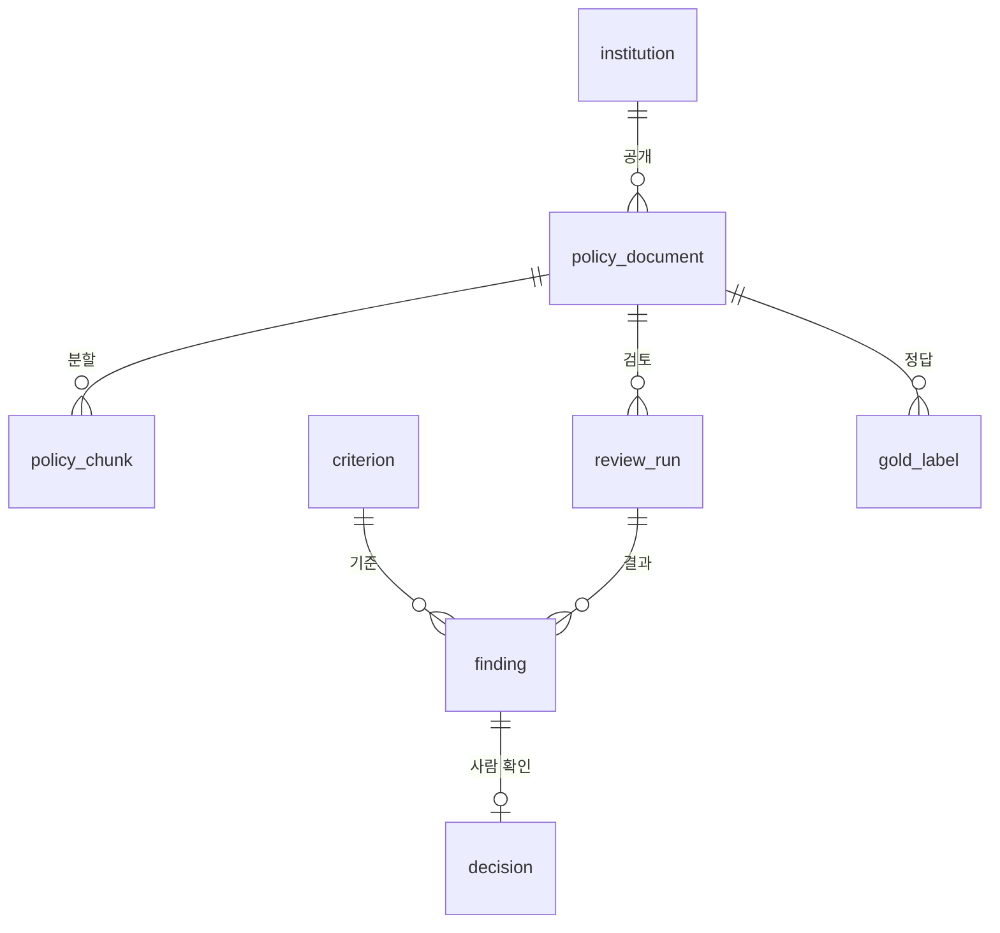

# 주제안 — 개인정보 처리방침 검토 보조

기준일: 2026-09-27 · 도메인: 개인정보 보호 컴플라이언스 · 상태: **제안, 팀 확정 전**

기관의 개인정보처리방침이 개인정보 보호법이 요구하는 항목을 갖췄는지 항목별로 판정하고, 근거 문단과 고칠 문장을 함께 내놓는 도구입니다. 사용자는 개인정보 보호책임자(CPO)와 담당 실무자입니다. 지금은 법 조문과 작성지침을 펴놓고 처리방침을 한 줄씩 대조하는 일입니다.

이 문서는 [착수 회의 자료](./09-착수회의.md)의 1순위 주제를 하나로 좁힌 것입니다. 아래 수치와 출처는 2026-09-27에 확인했고, 실제 수집·학습은 아직 하지 않았습니다.

## 왜 이 주제인가

### 1. 정답 기준을 우리가 만들지 않아도 됩니다

개인정보 보호법 제30조 제1항이 처리방침에 넣어야 할 항목을 **11개 호로 열거**합니다. 검토 기준을 창작할 필요가 없고, 모델이 기준을 지어낼 여지도 없습니다.

| 호 | 항목 | 구분 |
| --- | --- | --- |
| 1 | 개인정보의 처리 목적 | 필수 |
| 2 | 개인정보의 처리 및 보유 기간 | 필수 |
| 3 | 개인정보의 제3자 제공에 관한 사항 | 조건부 |
| 3의2 | 파기절차 및 파기방법 (보존 시 보존근거·항목 포함) | 필수 |
| 3의3 | 민감정보의 공개 가능성 및 비공개 선택 방법 | 조건부 |
| 4 | 개인정보 처리의 위탁에 관한 사항 | 조건부 |
| 4의2 | 가명정보의 처리 등에 관한 사항 | 조건부 |
| 5 | 정보주체와 법정대리인의 권리·의무 및 행사방법 | 필수 |
| 6 | 개인정보 보호책임자 성명 또는 부서 명칭과 연락처 | 필수 |
| 7 | 자동 수집 장치의 설치·운영 및 거부에 관한 사항 | 조건부 |
| 8 | 그 밖에 대통령령으로 정한 사항 | 필수 |

**조건부 5개(3, 3의3, 4, 4의2, 7)는 법이 "해당되는 경우에만 정한다"고 씁니다.** 문서만 보고 해당 여부를 알 수 없으면 확정하지 않고 사람에게 넘깁니다. 공통 판정 라벨의 `확인 필요`가 억지로 만든 상태가 아니라 도메인이 실제로 요구하는 상태라는 뜻입니다.

여기에 개인정보위의 [개인정보 처리방침 평가에 관한 고시](https://law.go.kr/LSW//admRulLsInfoP.do?admRulSeq=2100000236594)(고시 제2024-3호, 2024-02-20 시행)가 적정성·가독성·접근성 3개 분야에 26개 항목·42개 지표를 두고 있습니다. 공식 평가 체계가 이미 존재합니다.

### 2. 자료가 오늘 있고 라이선스가 명확합니다

기준 문서는 법령 API와 개인정보위 공개 자료로 바로 받습니다. 검토 대상은 공공기관과 지자체가 법적으로 공개하고 있는 처리방침이고, 공공저작물이라 이용 근거가 분명합니다. 자세한 경로는 아래 데이터 절에 정리했습니다.

### 3. 25개 사례 중 같은 것을 한 팀이 없습니다

[FINAL 25개 비교](./02-FINAL-25개-비교.md)를 분야별로 세면 문서 검토·생성 8개, 사내 업무 보조 6개입니다. 법규 준수 검토는 똑소리 1개뿐이고 자체 sLLM 학습은 확인되지 않았습니다.

검증된 분야(문서 검토는 8개 중 5개가 학습 설정·코드를 보고)에 속하면서 도메인은 겹치지 않습니다. 반대로 가장 인기 있는 사내 업무 보조는 6개 중 5개가 파인튜닝 증거 미확인입니다.

## 데이터

### 기준 문서 — 소량, 고품질

| 자료 | 출처 | 확보 방법 |
| --- | --- | --- |
| 개인정보 보호법 제30조, 시행령 제31조 | [국가법령정보 OPEN API](https://open.law.go.kr/LSO/openApi/guideList.do) | API 신청 후 조문 단위 수집 |
| 개인정보 처리방침 작성지침 (2025.4) | [개인정보 포털](https://www.privacy.go.kr/front/bbs/bbsView.do?bbsNo=BBSMSTR_000000000049&bbscttNo=20806) | PDF 내려받기 |
| 처리방침 평가에 관한 고시 | [국가법령정보센터](https://law.go.kr/LSW//admRulLsInfoP.do?admRulSeq=2100000236594) | 별표의 항목·지표 추출 |

### 검토 대상 — 대량

공공기관과 지방자치단체는 처리방침을 웹사이트에 공개할 의무가 있습니다. 243개 지자체, 중앙부처, [지방 출자출연기관 857개](https://www.data.go.kr/data/15065372/fileData.do)를 합하면 수천 건 규모입니다.

[저작권법 제24조의2](https://casenote.kr/%EB%B2%95%EB%A0%B9/%EC%A0%80%EC%9E%91%EA%B6%8C%EB%B2%95/%EC%A0%9C24%EC%A1%B0%EC%9D%982)에 따라 국가·지자체가 업무상 작성해 공표한 저작물은 허락 없이 이용할 수 있습니다. 다만 [공공누리](https://www.kogl.or.kr/info/freeUse.do) 제3·4유형은 변경을 금지하므로 **기관별 유형을 수집 단계에서 기록**합니다. 학습 데이터는 1·2유형 위주로 구성하고, 3·4유형은 평가 입력으로만 씁니다.

**이 도메인은 개인정보를 다루지 않습니다.** 처리방침은 개인정보를 어떻게 처리하는지 설명하는 메타 문서라서, 수집물 안에 개인정보가 들어가지 않습니다.

## 처리 흐름


파란 상자가 모델 호출, 주황 상자가 사람 확인입니다. 기준화 단계는 법 조문이 이미 구조화되어 있어 코드로 대체할 여지도 있습니다. 첫 주에 둘 다 해보고 정합니다.

판정 예시:

- `충족` — 제6호에 대해 "개인정보 보호책임자: 정보화담당관, 전화 02-000-0000" 문단을 근거로 제시
- `부분 충족` — 제2호에 보유 기간은 있으나 처리 목적별 구분이 없음
- `미기재` — 제4의2호 가명정보 항목이 문서 전체에 없음
- `불일치` — 제3호 제3자 제공 항목에 제공받는 자는 있으나 보유기간이 다른 절에서 모순
- `확인 필요` — 제4호 위탁. 해당 기관이 위탁을 하는지 문서만으로 알 수 없음

## 저장 구조



| 테이블 | 담는 것 |
| --- | --- |
| institution | 기관명, 유형, 홈페이지, 공공누리 유형, 수집일 |
| policy_document | 수집 URL, 수집일시, 원문 전문, 문서 해시, 처리방침 시행일 |
| policy_chunk | 문단 번호, 원문, 임베딩 — 근거 인용이 여기에 걸립니다 |
| criterion | 조항 ID(제30조1항3호), 제목, 법 원문 인용, 필수·조건부 |
| review_run | 모델·프롬프트 해시, 상태, 실행 시각, 토큰 사용량 |
| finding | 판정, 사유, 근거 chunk ID, 수정 제안, 검증 이슈 |
| decision | 담당자, 채택·반려·수정, 사유, 시각 |
| gold_label | 정답 판정, 검수자, train·validation·test 분할 |

처리방침은 개정되고 법도 개정됩니다. 문서 버전과 조문 버전을 모두 남기고, 실행마다 입력 해시를 기록해 나중에 같은 조건을 재현할 수 있게 합니다.

## sLLM 파인튜닝 태스크

```
입력: 법 조항 1개 + 처리방침 관련 문단 N개
출력: {판정, 사유, 근거 인용, 수정 제안} JSON
```

태스크 하나만 학습시킵니다. 지식을 외우게 하는 것이 아니라 출력 형식과 판단 경계를 학습시키는 것이므로 2~4B급부터 시작하고, 부족하다는 결과가 나오면 7~8B급을 비교합니다.

HumouR는 EXAONE 3.5 2.4B로 STAR 변환 하나를 학습했습니다. 비교 사례의 모델은 Qwen 계열 4팀, Kanana 1.5 8B 2팀으로 2.4B에서 12B까지 분포합니다.

## 평가

정답셋은 법 조문 11개 호에 대한 항목별 판정입니다. 처리방침은 "제3자 제공", "보유 기간" 같은 절 제목을 그대로 쓰는 경우가 많아, 섹션 제목과 키워드 매칭으로 1차 라벨 초안을 만들고 사람이 검수하는 순서가 효율적입니다.

1. 규칙 기반 1차 라벨 생성
2. 팀원 교차 검수로 100~150건 확정
3. 개발용·검증용·최종 평가용을 기관 단위로 분리

**처리방침은 양식이 서로 비슷합니다.** 기관들이 표준 양식을 복사해 쓰기 때문에, 같은 문구가 여러 분할에 섞이는 누출이 실제로 발생합니다. 공통 기반의 분할 검사(`app/dataset.py`)가 여기서 값을 합니다.

비교군은 베이스 모델 + 동일 문맥, 파인튜닝 모델 + 동일 문맥입니다. 지표는 판정별 precision·recall·F1, 근거 인용의 원문 일치율, JSON 유효율, 사람 수정량입니다.

## 선택하지 않은 안과 이유

| 후보 | 강점 | 탈락 이유 |
| --- | --- | --- |
| 조례 ↔ 상위법 위임범위 | 법제처 API가 조례 조문과 상위법 근거 조문의 연계 정보를 함께 제공. 근거 인용이 가장 풍부 | 위임범위 일탈 판정이 법적 판단이라 5명이 정답을 합의하기 어려움 |
| 채용공고 차별표현 검토 | [워크넷 API](https://www.data.go.kr/data/3038225/openapi.do)로 수만 건 확보, 크롤링 불필요 | 공고가 짧아 근거 인용이 한 문장. 문서 검토가 아니라 문장 분류에 가까움 |
| 식품 부당광고 검토 | 식약처가 적발 유형과 건수를 정기 공표해 정답 참조 가능 | 광고 문구를 쇼핑몰에서 수집해야 해 약관·저작권 문제. 문서가 너무 짧음 |
| 특허 명세서 기재요건 | KIPRIS API로 전문 확보, 거절이유통지가 정답 | 5명이 기재불비를 판정할 수 없어 정답 검수가 불가능 |

조례 안은 2순위로 남깁니다. 본 주제가 평가까지 끝난 5주차 이후에 팩을 하나 더 얹어 확장성을 시연하는 용도로는 적합합니다. 그 전에 손대면 둘 다 미완성으로 끝납니다.

## 1주차에 확인할 것

1. **판정 교차 검토** — 지자체 3곳의 처리방침을 받아 법 11개 호로 팀원 5명이 각자 판정하고, 갈리는 항목을 확인합니다. 30분이면 주제 확정 여부가 갈립니다.
2. **수집 경로** — 기관 목록에서 처리방침 URL을 찾는 규칙이 성립하는지 20건으로 확인합니다.
3. **공공누리 유형** — 표본 기관의 유형 표시를 확인하고 1·2유형 비율을 기록합니다.
4. **법령 API** — 국가법령정보 OPEN API 신청과 제30조 조문 수집을 끝냅니다.
5. **베이스라인** — 고정한 사례 10건에 베이스 모델을 돌려 JSON 유효율과 근거 인용 일치율을 기록합니다.

1번이 실패하면 주제를 바꿉니다. 자료가 아무리 많아도 사람이 정답에 합의하지 못하면 평가가 성립하지 않습니다.

## 출처

- [개인정보 보호법 제30조](https://casenote.kr/%EB%B2%95%EB%A0%B9/%EA%B0%9C%EC%9D%B8%EC%A0%95%EB%B3%B4_%EB%B3%B4%ED%98%B8%EB%B2%95/%EC%A0%9C30%EC%A1%B0)
- [개인정보 처리방침 평가에 관한 고시](https://law.go.kr/LSW//admRulLsInfoP.do?admRulSeq=2100000236594)
- [개인정보 처리방침 작성지침 (2025.4)](https://www.privacy.go.kr/front/bbs/bbsView.do?bbsNo=BBSMSTR_000000000049&bbscttNo=20806)
- [국가법령정보 OPEN API 활용가이드](https://open.law.go.kr/LSO/openApi/guideList.do)
- [저작권법 제24조의2 공공저작물의 자유이용](https://casenote.kr/%EB%B2%95%EB%A0%B9/%EC%A0%80%EC%9E%91%EA%B6%8C%EB%B2%95/%EC%A0%9C24%EC%A1%B0%EC%9D%982)
- [공공저작물 자유이용 — 공공누리](https://www.kogl.or.kr/info/freeUse.do)
- [행정안전부 지방 출자출연기관 현황](https://www.data.go.kr/data/15065372/fileData.do)
- [법제처 자치법규 본문 조회 API](https://www.data.go.kr/data/15058294/openapi.do)
- [한국고용정보원 워크넷 채용정보 API](https://www.data.go.kr/data/3038225/openapi.do)

법령 조문과 고시 내용은 확인 시점 기준입니다. 실제 구현 전에 현행 조문을 다시 확인하고, 개정이 있으면 기준 문서를 갱신합니다.
